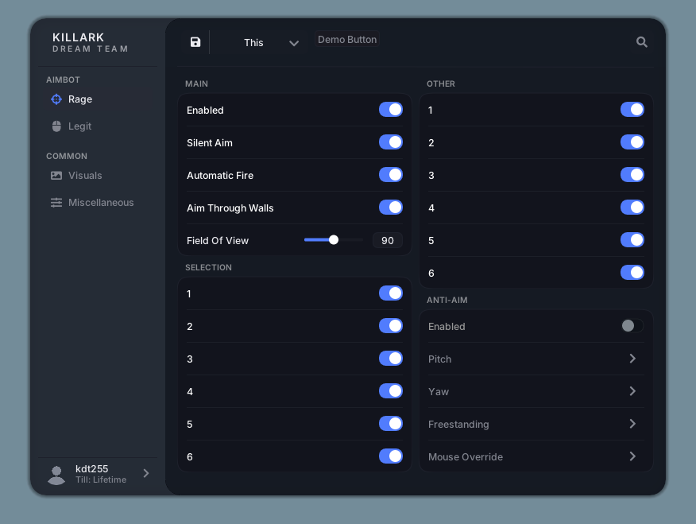
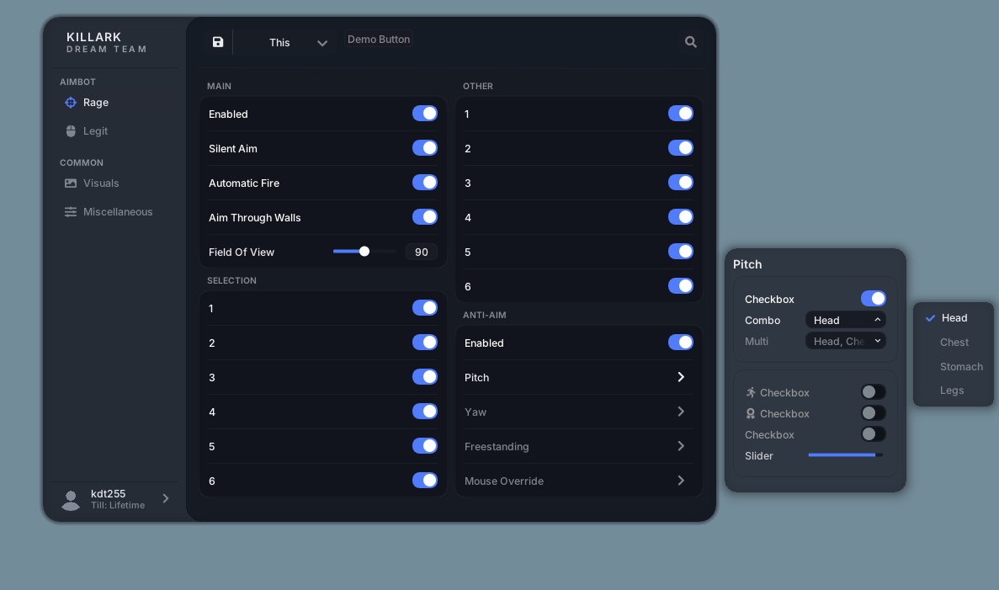
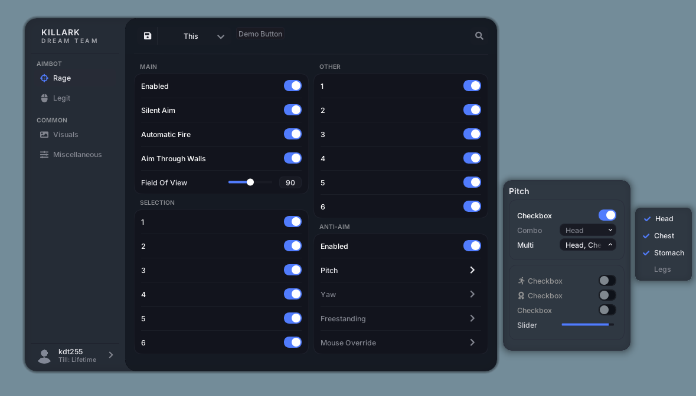
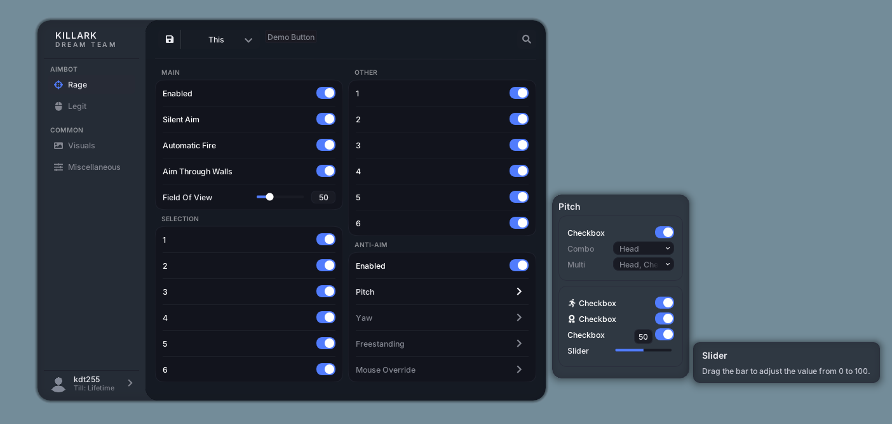
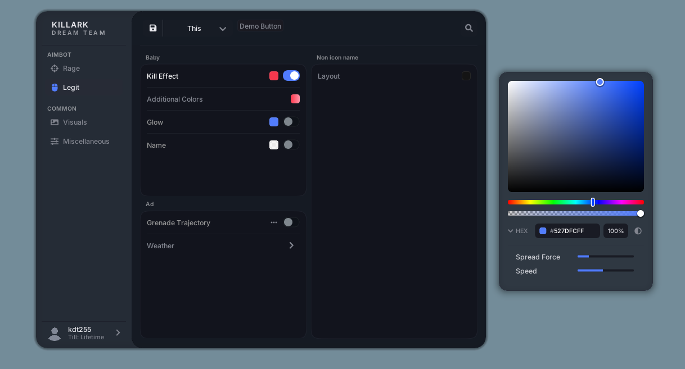
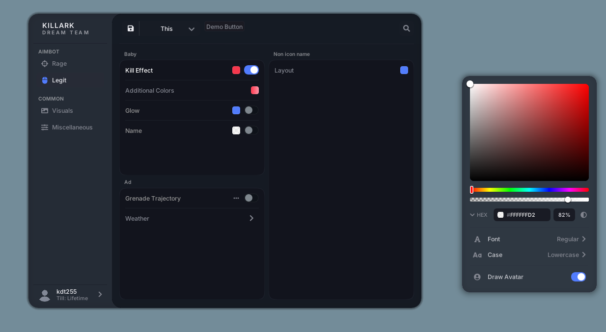
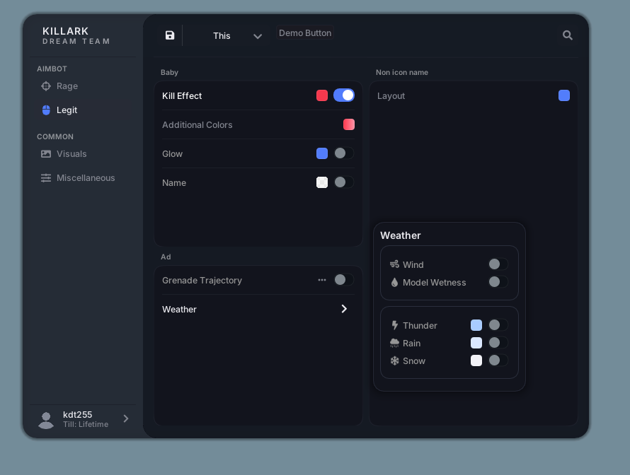
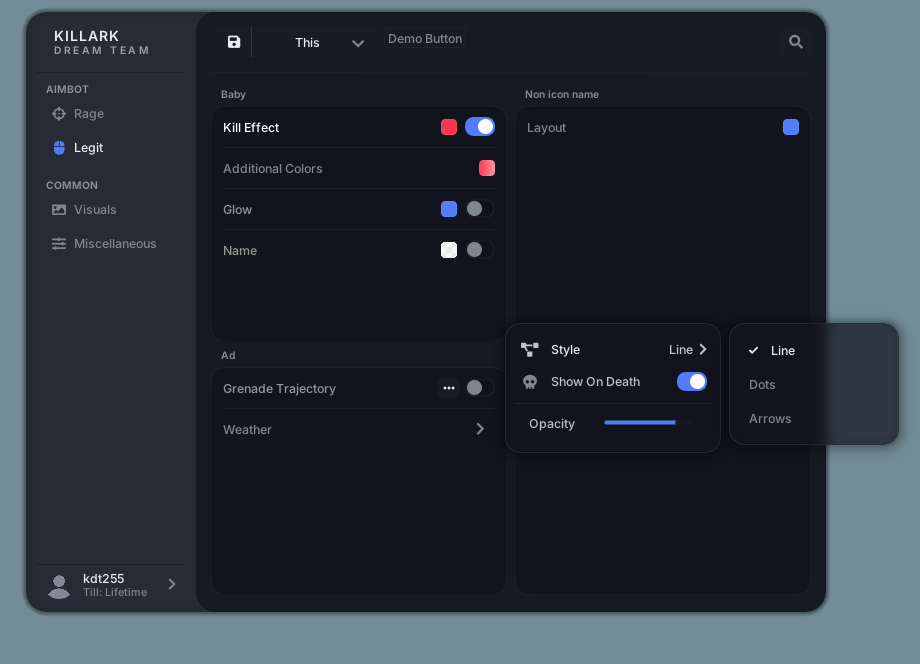
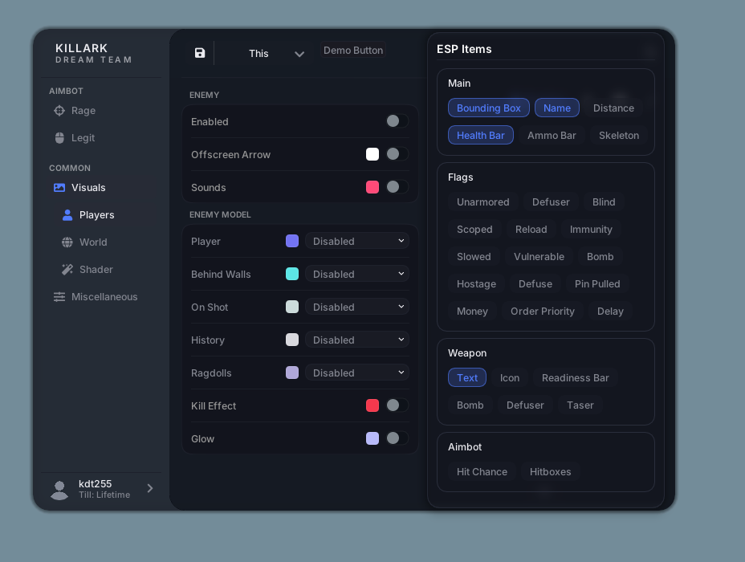
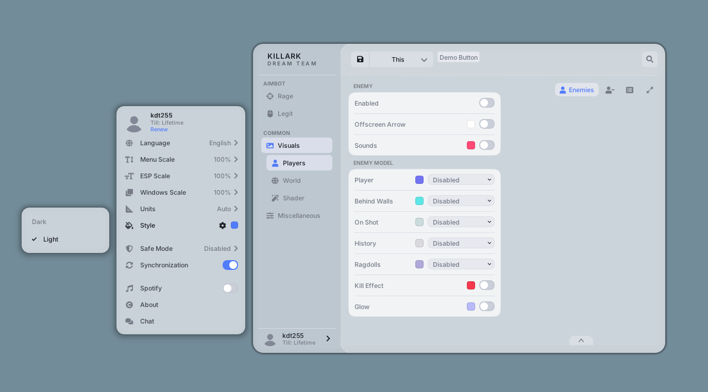

# Neverlose Reloaded

> [!WARNING]
> This project originally started as a DX9 project and was later converted to DX11.
> Please do not download or use it expecting a DX9 version.
>
> This is a 1:1 recreation of the Neverlose Reloaded menu.
> It does not contain anything that gets injected into the game.

<p align="center">
  
</p>

<p align="center"><strong>C++17 · Dear ImGui · Win32 · Direct3D 11</strong></p>

Neverlose Reloaded is a Windows desktop UI project built with Dear ImGui. It explores a compact, dark interface with a blue accent, custom controls, nested popups, and a multi-page navigation layout.

The repository includes the UI application and its Dear ImGui source, Windows/rendering backends, example project, visual references, and supporting UI components. The screenshots below are interface showcases: the labels and controls shown are not evidence of game-side functionality. This repository does not include a game connector or implementation that applies those options to a game.

## Highlights

- **Multi-page layout:** Rage, Legit, Visuals, Players, World, Shader, and Miscellaneous sections.
- **Custom controls:** animated toggles, sliders, combo boxes, multi-select lists, color pickers, pill buttons, and nested setting panels.
- **Visual styling:** dark and light presentations, blue accent colors, rounded cards, spacing, and compact typography.
- **Rendering experiments:** Win32 input, Direct3D 11 rendering, blur and shader effects, and animated background support.
- **C++17 codebase:** built around Dear ImGui with a Windows Visual Studio example project.

## Screenshots

<table>
  <tr>
    <td align="center"><br /><sub>Rage page and main controls</sub></td>
    <td align="center"><br /><sub>Nested settings and multi-select popup</sub></td>
  </tr>
  <tr>
    <td align="center"><br /><sub>Selection controls</sub></td>
    <td align="center"><br /><sub>Sliders, tooltips, and secondary panels</sub></td>
  </tr>
  <tr>
    <td align="center"><br /><sub>Legit page and color editing</sub></td>
    <td align="center"><br /><sub>Color, font, and text settings</sub></td>
  </tr>
  <tr>
    <td align="center"><br /><sub>Nested weather options</sub></td>
    <td align="center"><br /><sub>Style, visibility, and opacity options</sub></td>
  </tr>
  <tr>
    <td align="center"><br /><sub>Visuals page and grouped item controls</sub></td>
    <td align="center"><br /><sub>Light theme and menu preferences</sub></td>
  </tr>
</table>

## Build and Run

### Requirements

- Windows
- Visual Studio with the **Desktop development with C++** workload
- A Windows SDK and an installed MSVC platform toolset supported by the project
- A Direct3D 11-capable graphics device

### Visual Studio

1. Clone this repository:

   ```powershell
   git clone https://github.com/kdt255/Neverlose-Reloaded.git
   cd Neverlose-Reloaded
   ```

2. Open `examples/imgui_examples.sln` in Visual Studio.
3. Select **Release** and **x64** in the configuration toolbar.
4. Choose **Build → Build Solution**.
5. Run the `example_win32_directx9` project from Visual Studio. The generated executable is placed under `examples/example_win32_directx9/Release/`.

The solution and project directory keep the historical `directx9` name, but the current example uses the **Direct3D 11** backend. If Visual Studio reports that a platform toolset is missing, open the project properties and select a toolset installed on your machine.

### Command Line

Run this from a Visual Studio Developer PowerShell or Developer Command Prompt:

```powershell
msbuild .\examples\imgui_examples.sln -p:Configuration=Release -p:Platform=x64
```

## Repository Layout

| Path | Contents |
| --- | --- |
| `assets/` | Menu screenshots and visual references used in this README. |
| `backends/` | Dear ImGui platform and renderer backends. |
| `docs/` | Dear ImGui documentation and integration notes. |
| `examples/example_win32_directx9/` | The Windows UI application, Visual Studio project, and supporting components. |
| `audit/` | UI probes, comparison references, and audit materials; not required to build the example. |
| `imgui*.cpp`, `imgui*.h`, `imstb_*.h` | Dear ImGui core and bundled headers. |

## AI Disclosure

**Note:** AI (Artificial Intelligence) was used while creating this menu.

## License and Credits

This project is released under the MIT License; see [`LICENSE`](LICENSE). The repository also contains Dear ImGui and other third-party components. Their original notices and license terms continue to apply; see the included component documentation and the [Dear ImGui license](https://github.com/ocornut/imgui/blob/v1.89.7/LICENSE.txt).
